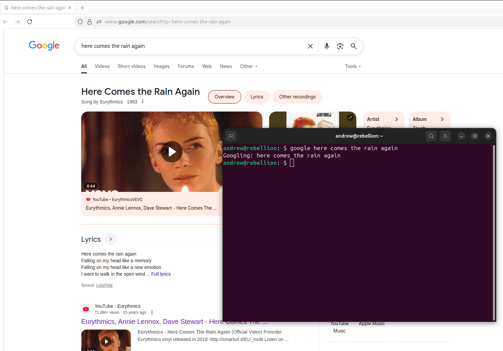

# googlebash

Calling a google search from your terminal / command line

## Usage Example:

```ruby
# On Terminal:
googleh foo bar baz
```


### Setup

```ruby
# Download this repository
git clone https://github.com/andrewrgarcia/googlebash.git

# Access cloned directory
cd googlebash
```

place **googleh.sh** in any particular destination folder i.e. $HOME/my_folder/

```ruby
# On Terminal inside this folder:
chmod +x googleh.sh

# --- To call script from anywhere ---
# On Terminal, type:
gedit .bashrc

# On **.bashrc** file, type:
alias googleh=`$HOME/my_folder/googleh.sh` 

# On Terminal, type:
source ~/.bashrc
```


